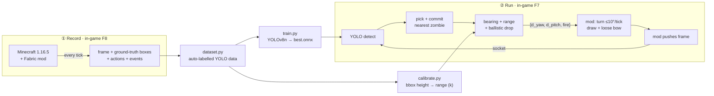
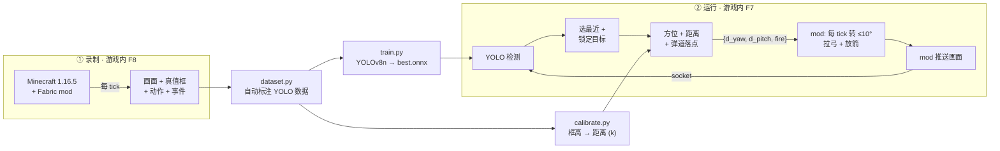

<div align="center">

# 🏹 Minecraft vision aimbot

**A vision-only bow-combat agent for Minecraft (Java 1.16.5).**
It sees zombies in the rendered frame with YOLO, leads + drop-compensates the shot, and fires the bow — like an FPS computer-vision aimbot, but for archery.

**纯视觉弓箭战斗智能体（Minecraft Java 1.16.5）。** 用 YOLO 从游戏画面里认出僵尸,自动算落点、转身拉弓放箭 —— 像 FPS 视觉自瞄,但玩的是弓。


[English](#english) · [中文](#中文)

`git clone https://github.com/BotKnqP/MC_visi0n_aim`

</div>

> ⚠️ **Research / single-player only.** This drives the local client by reading the rendered screen and synthesizing keyboard/mouse input. Do **not** use it on public/multiplayer servers. 仅供单机研究,**请勿用于联机/公共服务器作弊**。

---

## English

### What it is

This agent plays a horde-survival bow scenario in Minecraft **entirely from pixels**. At runtime it never reads entity coordinates from the game — a YOLO detector finds zombies in the rendered frame, the agent picks the nearest one, computes where to aim (screen bearing + range from the box size + Minecraft's exact arrow ballistics), and a small Fabric mod turns the view and looses the arrow.

Getting the detector is a self-contained loop: a Fabric mod records gameplay and **auto-labels it for free** (it projects each mob's true bounding box to the screen), so you train a zombie detector on your own footage with zero hand-labelling.

### Features

- 🎯 **FPS-aimbot target logic** — selects the zombie nearest the **crosshair** inside an FOV cone (not the biggest box), commits to it with switch-hysteresis, and pans toward off-cone targets — so the view doesn't whip around. Then aim (bearing + range + arrow drop) → turn + fire. No privileged coordinates.
- 🟩 **In-game ESP overlay** — while the runtime is on, the live YOLO boxes are drawn right on the game screen (red = engaged target, yellow = approaching, green = other). Toggle with **F9**; they're drawn *after* the detector's frame is captured, so they never feed back into detection.
- 🏷️ **Free auto-labelled data** — the mod projects ground-truth mob AABBs to screen pixels, emitting perfect YOLO labels while you play.
- 🚀 **Pipelined low-overhead protocol** — raw-BGR frames (no PNG encode, ~10-20 ms saved per capture), binary action payload (no JSON parse), and writer/reader threads on both sides so detection wall-clock no longer caps capture rate. Magic-byte switched, so both raw/PNG and binary/JSON peers interoperate.
- 🧮 **Exact ballistics** — tick-accurate arrow simulation (drag 0.99, gravity 0.05, full-charge speed 3.0 blk/tick) for drop compensation, and a data-fitted `distance = k / bbox_height` range model.
- 🖥️ **CPU or GPU, two backends** — runs on CPU by default; `--device cuda:0` runs through `onnxruntime` (DirectML on Windows → CUDA → CPU provider auto-pick) and **auto-falls back to CPU on OOM**. `.pt` weights stay on the Ultralytics path; `.onnx` uses the faster direct ORT path when installed.
- ✅ **Tested core** — pure-logic modules (action mapping, ballistics, aim, protocol, dataset, ORT pre/post) ship with self-tests (31 tests, all green).

### How it works



**Runtime decision (per frame):**
1. **Perceive** — run YOLO on the 427×240 frame → zombie boxes (`conf ≥ 0.25`).
2. **Target** — pick the box **nearest the crosshair** within an FOV cone, **commit** to it with switch-hysteresis (only switch if it's gone or a much-better target appears). If targets are only off to the side, pan toward the nearest one ("look to the other side").
3. **Aim** — box center → relative `(yaw, pitch)` via a pinhole model; box height → distance via the calibrated `k`; `ballistic.solve_pitch` adds the gravity drop.
4. **Act** — the mod turns the view (damped, ≤8°/tick) toward the aim point, holds the bow to charge, and looses when aligned (2 consecutive frames) + fully drawn. A 0.5 s grace keeps the shot alive through brief detection gaps; with no target it eases the pitch back to the horizon and keeps scanning.

**Honest limits.** The bundled detector is a single-class YOLOv8n at ~0.39 mAP (weak on far/tiny zombies), and CPU inference runs ~10 fps. It clears light waves reliably; heavier pressure wants GPU inference and a stronger detector (train at higher `imgsz` on more footage).

### Requirements

| Component | Version / notes |
|---|---|
| Minecraft | **Java Edition 1.16.5** + Fabric Loader + **fabric-api 0.42.0+1.16** |
| Mod build | a JDK (17–21) on PATH; the **bundled `gradlew`** fetches Gradle 8.5 + the Java-8 toolchain automatically — no Gradle or IDE install needed |
| Python | 3.10+ (tested on 3.12) |
| Python deps | `numpy pillow opencv-python ultralytics` + `torch` (a CUDA build to use the GPU) |

### Install

```bash
# 1) Python side
cd python
pip install -r ../requirements.txt           # numpy, pillow, opencv-python, ultralytics
# torch: pick the CUDA build for your GPU, e.g.
#   pip install torch --index-url https://download.pytorch.org/whl/cu121
python -m mc_bow_agent.selftest               # sanity-check the core math (6/6)

# 2) Mod side  (the Gradle wrapper jar is bundled — only a JDK on PATH is needed)
cd ../mod
.\gradlew.bat build          # Windows -> build/libs/mcbowagent-0.0.1.jar
                             # Linux/macOS: run `gradle wrapper` once to generate ./gradlew, then ./gradlew build
# copy that jar into your  .minecraft/mods/  folder, launch the 1.16.5-Fabric profile
```

### Usage

In-game keys (added by the mod): **F7** vision runtime · **F8** record · **F9** toggle the box overlay · **F10** scripted bow-aimbot.

A ready-made **CS2 "aim_botz"-style arena** datapack ships in [`datapacks/zombie_arena/`](datapacks/zombie_arena) — drop it in your world's `datapacks/`, `/reload`, and press the in-world **START** button to spawn up to 8 one-hit targets (its `clock`/`tick`/`spawn_one` functions also despawn corpses and clean up stray arrows). Use it as the training arena and the live test range.

**① Record training data** — build/load an arena that spawns zombies, then press **F8** and play (or let F10 drive). Frames + auto-labels land in `runs/run_*/` (the output dir is `RecorderConfig.outputBaseDir` — edit it to your path).

**② Train the detector**
```bash
cd python
python -m mc_bow_agent.dataset  ../runs  -o ../datasets/zombie  --classes zombie
python -m mc_bow_agent.train    --data ../datasets/zombie/data.yaml --epochs 40 --batch 16 \
                                --device 0 --workers 0 --cache disk        # -> best.pt + best.onnx
python -m mc_bow_agent.calibrate ../runs --class zombie                    # prints the range constant k
```

**③ Run the agent** — in-game press **F7** (starts the mod's socket server + shows the box overlay), then:
```bash
# run from inside ./python (so `runs/...` resolves) -- or pass an absolute path from the repo root.
# CPU (default; imgsz auto = 320)
python -m mc_bow_agent.runtime_loop --weights runs/detect/mcbow_zombie_v2/weights/best.onnx --device cpu
# GPU (lower Minecraft's RAM first to free commit memory; imgsz auto = 416, OOM auto-falls back to CPU)
python -m mc_bow_agent.runtime_loop --weights runs/detect/mcbow_zombie_v2/weights/best.onnx --device cuda:0
```
The boxes show **in-game** (toggle F9). Add `--show` for a separate OpenCV debug window; pass `--imgsz 320/416` to override the auto size.

> **Weights aren't committed** (`*.pt/*.onnx` are git-ignored). Either train your own (steps above), or grab a pretrained `best.onnx` from the [Releases](../../releases) and point `--weights` at it.

### Project layout

```
MC_visi0n_aim/
├─ python/mc_bow_agent/
│  ├─ runtime_loop.py · protocol.py · runtime.py   # live loop + socket + YOLO wrapper
│  ├─ aim.py · ballistic.py · calibrate.py          # target commit, drop solve, range fit
│  ├─ dataset.py · train.py · predict_check.py      # recordings → YOLO dataset → model
│  ├─ constants.py · action_mapping.py · data_schema.py
│  └─ selftest*.py                                  # unit tests
├─ mod/ (Fabric 1.16.5, bundled gradlew)
│  └─ …/mcbowagent/  McBowAgentMod, record/, vision/ (incl. the ESP overlay), oracle/, net/RuntimeBridge
├─ datapacks/zombie_arena/   # the CS2-style aim_botz test arena (functions + predicates)
├─ docs/  FABRIC_MOD_SPEC.md · RUNTIME_PROTOCOL.md · BUILD_PLAN.md
└─ assets/  demo.gif · make_gif.py
```

### License

[MIT](LICENSE). Uses Minecraft via the [Fabric](https://fabricmc.net/) toolchain and [Ultralytics YOLO](https://github.com/ultralytics/ultralytics). For single-player research use only.

---

## 中文

### 这是什么

本智能体在 Minecraft 里玩"波次生存弓箭战斗",**完全靠画面像素**。运行时它**不读取游戏里的实体坐标**——YOLO 检测器从渲染画面里认出僵尸,智能体选最近的一只,算出该往哪瞄(屏幕方位 + 由框大小估的距离 + Minecraft 精确箭矢弹道),再由一个 Fabric mod 转动视角、把箭射出去。

检测器是自给自足练出来的:Fabric mod 一边录制一边**免费自动打标**(把每只怪的真实包围盒投影到屏幕),所以你用自己的录像训一个僵尸检测器,**零手工标注**。

### 特性

- 🎯 **FPS 外挂式选靶** —— 选**离准星最近**(不是框最大)且在 FOV 锥内的僵尸,带切换迟滞锁定,锥外目标则缓缓转过去——视角不乱甩。再瞄准(方位 + 距离 + 箭落点)→ 转身放箭,不依赖特权坐标。
- 🟩 **游戏内识别框(ESP)** —— 运行时把实时 YOLO 框**直接画在游戏画面上**(红=交战目标、黄=接近中、绿=普通),**F9** 开关。框在检测器截帧**之后**才画,绝不污染检测。
- 🏷️ **免费自动标注数据** —— mod 把怪物真实 AABB 投到屏幕像素,边玩边生成完美 YOLO 标签。
- 🔌 **锁步 socket 桥** —— mod 把画面流给 Python,Python 回 `{d_yaw, d_pitch, fire}`,mod 用"只转视角 + 模拟按键"的合法 aimbot 执行(绝不瞬移)。
- 🧮 **精确弹道** —— tick 级箭轨仿真(阻力 0.99、重力 0.05、满蓄力 3.0 格/tick)做落点补偿;并用真值拟合的 `距离 = k / 框高` 测距。
- 🖥️ **CPU / GPU 皆可** —— 默认 CPU;`--device cuda:0` 用训练的 640px 推理,**显存不足自动回退 CPU**(共享显卡也不崩)。
- ✅ **核心带测试** —— 动作映射 / 弹道 / 瞄准 / 协议 / 数据集等纯逻辑模块均自带单测。

### 工作原理



**每帧决策:**
1. **感知** —— 对 427×240 画面跑 YOLO → 僵尸框(`conf ≥ 0.25`)。
2. **选靶** —— 取 FOV 锥内**离准星最近**的框,带切换迟滞**锁定**(只有它消失、或出现明显更好的目标才切);若目标全在侧边,则朝最近的那只缓缓转过去("看向另一侧")。
3. **瞄准** —— 框中心 → 相对 `(yaw, pitch)`(针孔模型);框高 → 距离(标定的 `k`);`ballistic.solve_pitch` 加上重力落点补偿。
4. **执行** —— mod 朝瞄点**阻尼转向**(≤8°/tick),拉弓蓄力,连续两帧对齐 + 满蓄力时放箭。0.5 秒 grace 让短暂丢检测时这一箭还能打完;没目标时把俯仰缓缓拉回地平线并继续扫描。

**实话实说。** 自带检测器是单类 YOLOv8n,约 0.39 mAP(远处小僵尸漏检多),CPU 推理约 10 fps。轻量波次能稳定清场;更大压力需要 GPU 推理 + 更强检测器(更高 `imgsz`、更多录像重训)。

### 环境要求

| 组件 | 版本 / 说明 |
|---|---|
| Minecraft | **Java 版 1.16.5** + Fabric Loader + **fabric-api 0.42.0+1.16** |
| 编译 mod | PATH 上有 JDK(17–21)即可;**自带 `gradlew`** 会自动拉取 Gradle 8.5 + Java-8 toolchain——无需另装 Gradle 或 IDE |
| Python | 3.10+(在 3.12 上测过) |
| Python 依赖 | `numpy pillow opencv-python ultralytics` + `torch`(用 GPU 则装 CUDA 版) |

### 安装

```bash
# 1) Python 侧
cd python
pip install -r ../requirements.txt            # numpy, pillow, opencv-python, ultralytics
# torch：选你显卡的 CUDA 版,例如
#   pip install torch --index-url https://download.pytorch.org/whl/cu121
python -m mc_bow_agent.selftest                # 校验核心数学(6/6）

# 2) mod 侧（自带 wrapper jar，PATH 上有 JDK 即可，无需另装 Gradle/IDE）
cd ../mod
.\gradlew.bat build                            # Windows -> build/libs/mcbowagent-0.0.1.jar
                                               # Linux/macOS: 先 `gradle wrapper` 生成 ./gradlew，再 ./gradlew build
# 把该 jar 放进  .minecraft/mods/ ，用 1.16.5-Fabric 实例启动
```

### 使用

游戏内按键(mod 提供):**F7** 视觉运行时 · **F8** 录制 · **F9** 开关识别框 · **F10** 脚本弓箭 aimbot。

仓库自带一个 **CS2 "aim_botz" 风格靶场**数据包 [`datapacks/zombie_arena/`](datapacks/zombie_arena):放进你存档的 `datapacks/`、`/reload`,按世界里的 **START** 按钮即可刷出最多 8 个一击必杀靶(其 `clock`/`tick`/`spawn_one` 还会即时清除尸体、清理废箭)。既当训练靶场也当实测靶场。

**① 录制训练数据** —— 搭/载入一个会刷僵尸的竞技场,按 **F8** 开录并游玩(或让 F10 自动打)。画面 + 自动标签落在 `runs/run_*/`(输出路径是 `RecorderConfig.outputBaseDir`,改成你的路径)。

**② 训练检测器**
```bash
cd python
python -m mc_bow_agent.dataset  ../runs  -o ../datasets/zombie  --classes zombie
python -m mc_bow_agent.train    --data ../datasets/zombie/data.yaml --epochs 40 --batch 16 \
                                --device 0 --workers 0 --cache disk        # -> best.pt + best.onnx
python -m mc_bow_agent.calibrate ../runs --class zombie                    # 打印测距常数 k
```

**③ 运行智能体** —— 游戏内先按 **F7**(启动 mod 的 socket 服务 + 显示识别框),然后:
```bash
# 在 ./python 目录下跑(这样 `runs/...` 才能解析);或从仓库根传绝对路径。
# CPU（默认；imgsz 自动 = 320）
python -m mc_bow_agent.runtime_loop --weights runs/detect/mcbow_zombie_v2/weights/best.onnx --device cpu
# GPU（先在启动器把 MC 内存调低腾出提交内存；imgsz 自动 = 416，OOM 自动回退 CPU）
python -m mc_bow_agent.runtime_loop --weights runs/detect/mcbow_zombie_v2/weights/best.onnx --device cuda:0
```
识别框直接画在**游戏画面**里(F9 开关)。想要独立 OpenCV 调试窗口就加 `--show`;`--imgsz 320/416` 可覆盖自动尺寸。

> **权重不进库**(`*.pt/*.onnx` 已忽略)。要么自己训(上面步骤),要么去 [Releases](../../releases) 下载预训练的 `best.onnx`,把 `--weights` 指过去即可。

### 目录结构

```
MC_visi0n_aim/
├─ python/mc_bow_agent/
│  ├─ runtime_loop.py · protocol.py · runtime.py   # 实时循环 + socket + YOLO 封装
│  ├─ aim.py · ballistic.py · calibrate.py          # 目标锁定、落点解算、测距拟合
│  ├─ dataset.py · train.py · predict_check.py      # 录像 → YOLO 数据集 → 模型
│  ├─ constants.py · action_mapping.py · data_schema.py
│  └─ selftest*.py                                  # 单元测试
├─ mod/（Fabric 1.16.5，自带 gradlew）
│  └─ …/mcbowagent/  McBowAgentMod、record/、vision/（含 ESP 叠加）、oracle/、net/RuntimeBridge
├─ datapacks/zombie_arena/   # CS2 风格 aim_botz 测试靶场（functions + predicates）
├─ docs/  FABRIC_MOD_SPEC.md · RUNTIME_PROTOCOL.md · BUILD_PLAN.md
└─ assets/  demo.gif · make_gif.py
```

### 许可

[MIT](LICENSE)。通过 [Fabric](https://fabricmc.net/) 接入 Minecraft,检测用 [Ultralytics YOLO](https://github.com/ultralytics/ultralytics)。仅供单机研究使用。
