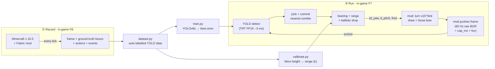
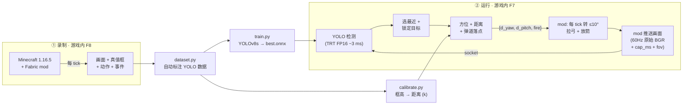

<div align="center">

# 🏹 Minecraft vision aimbot

**A vision-only bow-combat agent for Minecraft (Java 1.16.5).**
It sees zombies in the rendered frame with YOLO, leads + drop-compensates the shot, and fires the bow — like an FPS computer-vision aimbot, but for archery.

**纯视觉弓箭战斗智能体（Minecraft Java 1.16.5）。** 用 YOLO 从游戏画面里认出僵尸,自动算落点、转身拉弓放箭 —— 像 FPS 视觉自瞄,但玩的是弓。


[English](#english) · [中文](#中文)

`git clone https://github.com/BotKnqP/MC_visi0n_aim`

</div>

> ⚠️ **Research / single-player only.** This drives the local client by reading the rendered screen and synthesizing keyboard/mouse input. Do **not** use it on public/multiplayer servers. 仅供单机研究,**请勿用于联机/公共服务器作弊**。

---

## English

### What it is

This agent plays a horde-survival bow scenario in Minecraft **entirely from pixels**. At runtime it never reads entity coordinates from the game — a YOLO detector finds zombies in the rendered frame, the agent picks the nearest one, computes where to aim (screen bearing + range from the box size + Minecraft's exact arrow ballistics), and a small Fabric mod turns the view and looses the arrow.

Getting the detector is a self-contained loop: a Fabric mod records gameplay and **auto-labels it for free** (it projects each mob's true bounding box to the screen), so you train a zombie detector on your own footage with zero hand-labelling.

### Features

- 🎯 **FPS-aimbot target logic** — selects the zombie nearest the **crosshair** inside an FOV cone (not the biggest box), commits to it with switch-hysteresis, and pans toward off-cone targets — so the view doesn't whip around. Then aim (bearing + range + arrow drop) → turn + fire. No privileged coordinates.
- 🟩 **In-game ESP overlay** — live YOLO boxes are drawn right on the game screen (red = engaged target, yellow = approaching, green = other). Boxes are **pixel-shifted per render frame** using the interpolated render-camera yaw, so they stick to the silhouette during fast pans instead of trailing. Toggled with **F9**; drawn *after* the detector's capture, so they never feed back into detection.
- 🏷️ **Free auto-labelled data** — the mod projects ground-truth mob AABBs to screen pixels, emitting perfect YOLO labels while you play.
- ⚡ **Three-thread async pipeline** — recv-thread (socket → latest-frame slot) → detect-thread (YOLO under a lock guarding TargetState) → main (timer-driven sender at `--send-hz`). Inference latency no longer caps the control rate; the bot still ticks turns at 20 Hz even when the GPU stalls.
- 📐 **Per-frame FOV plumbing** — the mod stamps the actual projection FOV into every frame header (magic `'W'` = `[H][W][cap_ms][fov_x100]`). Python uses the **per-frame FOV** for bearing + range, and the calibration constant `k` is auto-rescaled by `tan(70°/2)/tan(actual_fov/2)`, so a model calibrated at FOV 70 still aims correctly at the user's actual FOV (93 / 110 / whatever).
- 🚀 **GPU inference, TensorRT-class speed, one `pip install`** — `onnxruntime` auto-picks the fastest available execution provider: **TensorRT EP** (~3 ms on RTX 4060, FP16 engine auto-built + cached under `.trt_cache/` on first run, no separate SDK) → CUDA EP (~8 ms) → DirectML → CPU. See [docs/TENSORRT.md](docs/TENSORRT.md) for the version matrix.
- 🖱️ **Mod-side polish** — bow-charge FOV zoom suppressed while runtime owns the view (mixin), runtime-only physical mouse suppressed during the turn (mixin), 60 Hz capture decoupled from the 20 Hz client tick (configurable `runtimeCaptureHz`), and **F6 cycles render resolution** (1280×720 → 960×540 → 854×480 → 1920×1080) without leaving fullscreen — for getting >60 game FPS on tighter hardware.
- 🧮 **Exact ballistics** — tick-accurate arrow simulation (drag 0.99, gravity 0.05, full-charge speed 3.0 blk/tick) for drop compensation, and a data-fitted `distance = k / bbox_height` range model (FOV-aware).
- ✅ **Tested core** — pure-logic modules (action mapping, ballistics, aim, protocol, dataset, ORT pre/post, bearing tracker, smoother) ship with 50 self-tests, all green.

### How it works



**Runtime decision (per frame):**
1. **Perceive** — YOLO on the 427×240 frame → zombie boxes (`conf ≥ 0.25`).
2. **Target** — pick the box **nearest the crosshair** within an FOV cone, **commit** with switch-hysteresis. If targets are only off to the side, pan toward the nearest one ("look to the other side").
3. **Aim** — box center → relative `(yaw, pitch)` via a pinhole model **using the per-frame FOV**; box height → distance via the calibrated `k` (FOV-rescaled); `ballistic.solve_pitch` adds the gravity drop.
4. **Act** — the mod turns the view (damped, ≤10°/tick, deadzone 1.2°) toward the aim point, holds the bow to charge, and looses when aligned (within 2°) + fully drawn. The `TargetState` keeps the bearing alive between detections by decaying it by the expected mod turn (gain + deadzone + clamp), with a 300 ms predict window for brief detection gaps. No target → ease pitch to horizon and keep scanning.

**Honest limits.** The current detector is a single-class YOLOv8s at ~0.39 mAP (still weak on far/tiny zombies). With TensorRT-EP inference, the bottleneck is now detection quality, not throughput — at 30 Hz capture + 3 ms inference you have plenty of frames; the model just needs more training data to catch distant boxes.

### Requirements

| Component | Version / notes |
|---|---|
| Minecraft | **Java Edition 1.16.5** + Fabric Loader + **fabric-api 0.42.0+1.16** |
| Mod build | a JDK (17–21) on PATH; the **bundled `gradlew`** fetches Gradle 8.5 + the Java-8 toolchain automatically — no Gradle or IDE install needed |
| Python | 3.10+ (tested on 3.12) |
| Python deps | `numpy pillow opencv-python ultralytics` + `torch` (CUDA build for GPU). For TensorRT/CUDA EP: `pip install "onnxruntime-gpu==1.22.0" nvidia-cudnn-cu12` (CUDA 12) and optionally `"tensorrt-cu12==10.7.0"` — see [docs/TENSORRT.md](docs/TENSORRT.md). |

### Install

```bash
# 1) Python side
cd python
pip install -r ../requirements.txt           # numpy, pillow, opencv-python, ultralytics
# torch: pick the CUDA build for your GPU, e.g.
#   pip install torch --index-url https://download.pytorch.org/whl/cu121
# OPTIONAL — for the ~3 ms TRT inference path (see docs/TENSORRT.md):
#   pip install "onnxruntime-gpu==1.22.0" nvidia-cudnn-cu12 "tensorrt-cu12==10.7.0"
python -m mc_bow_agent.selftest               # sanity-check the core math (6/6)

# 2) Mod side  (the Gradle wrapper jar is bundled — only a JDK on PATH is needed)
cd ../mod
.\gradlew.bat build          # Windows -> build/libs/mcbowagent-0.0.1.jar
                             # Linux/macOS: run `gradle wrapper` once to generate ./gradlew, then ./gradlew build
# copy that jar into your  .minecraft/mods/  folder, launch the 1.16.5-Fabric profile
```

### Usage

In-game keys (added by the mod): **F6** cycle render resolution · **F7** vision runtime · **F8** record · **F9** toggle the box overlay · **F10** scripted bow-aimbot.

A ready-made **CS2 "aim_botz"-style arena** datapack ships in [`datapacks/zombie_arena/`](datapacks/zombie_arena) — drop it in your world's `datapacks/`, `/reload`, and press the in-world **START** button to spawn up to 8 one-hit targets (its `clock`/`tick`/`spawn_one` functions also despawn corpses and clean up stray arrows). Use it as the training arena and the live test range.

**① Record training data** — build/load an arena that spawns zombies, then press **F8** and play (or let F10 drive). Frames + auto-labels land in `runs/run_*/` (output dir = `RecorderConfig.outputBaseDir` — edit to your path).

**② Train the detector**
```bash
cd python
python -m mc_bow_agent.dataset  ../runs  -o ../datasets/zombie  --classes zombie
python -m mc_bow_agent.train    --data ../datasets/zombie/data.yaml --epochs 40 --batch 16 \
                                --device 0 --workers 0 --cache disk        # -> best.pt + best.onnx
python -m mc_bow_agent.calibrate ../runs --class zombie                    # prints the range constant k
```

**③ Run the agent** — in-game press **F7** (starts the mod's socket server + shows the box overlay), then:
```bash
# GPU + TensorRT EP (~3 ms inference; first run compiles + caches the engine under .trt_cache/)
python -m mc_bow_agent.runtime_loop \
    --weights runs/detect/mcbow_zombie_v3/weights/best.onnx \
    --device cuda:0 --imgsz 640 --backend auto \
    --conf 0.25 --send-hz 20 --predict-ms 300

# CPU fallback (drop --device, drop --imgsz; auto picks imgsz=320)
python -m mc_bow_agent.runtime_loop --weights runs/detect/mcbow_zombie_v3/weights/best.onnx
```
The boxes show **in-game** (toggle F9). Add `--show` for a separate OpenCV debug window; `--debug-protocol` for per-frame trace. The mod plumbs the actual game FOV through the protocol, so the bot self-adapts if you change FOV in Video Settings.

Optional knobs: `--fire-conf 0.6` adds an independent firing confidence floor (default off — careful, far zombies have legitimately low conf); `--imgsz 416` for less GPU pressure; `--no-smooth` to disable the IoU detection smoother.

> **Weights aren't committed** (`*.pt/*.onnx` are git-ignored). Either train your own (steps above), or grab a pretrained `best.onnx` from the [Releases](../../releases) and point `--weights` at it.

### Project layout

```
MC_visi0n_aim/
├─ python/mc_bow_agent/
│  ├─ runtime_loop.py · protocol.py · runtime.py   # 3-thread loop + socket + ORT/TRT wrapper
│  ├─ aim.py · ballistic.py · calibrate.py          # target commit, drop solve, FOV-aware range
│  ├─ bearing_tracker.py · detect_tracker.py        # TargetState (decay) + IoU smoother
│  ├─ dataset.py · train.py · predict_check.py      # recordings → YOLO dataset → model
│  ├─ constants.py · action_mapping.py · data_schema.py
│  └─ selftest*.py                                  # 50 unit tests
├─ mod/ (Fabric 1.16.5, bundled gradlew)
│  └─ …/mcbowagent/  McBowAgentMod, record/, vision/ (ESP overlay), oracle/, net/RuntimeBridge,
│                    mixin/BowFovMixin (bow-zoom kill), mixin/MouseLookMixin (mouse suppress)
├─ datapacks/zombie_arena/   # the CS2-style aim_botz test arena (functions + predicates)
├─ docs/  TENSORRT.md · FABRIC_MOD_SPEC.md · RUNTIME_PROTOCOL.md · BUILD_PLAN.md
└─ assets/  demo.gif · make_gif.py
```

### License

[MIT](LICENSE). Uses Minecraft via the [Fabric](https://fabricmc.net/) toolchain and [Ultralytics YOLO](https://github.com/ultralytics/ultralytics). For single-player research use only.

---

## 中文

### 这是什么

本智能体在 Minecraft 里玩"波次生存弓箭战斗",**完全靠画面像素**。运行时它**不读取游戏里的实体坐标**——YOLO 检测器从渲染画面里认出僵尸,智能体选最近的一只,算出该往哪瞄(屏幕方位 + 由框大小估的距离 + Minecraft 精确箭矢弹道),再由一个 Fabric mod 转动视角、把箭射出去。

检测器是自给自足练出来的:Fabric mod 一边录制一边**免费自动打标**(把每只怪的真实包围盒投影到屏幕),所以你用自己的录像训一个僵尸检测器,**零手工标注**。

### 特性

- 🎯 **FPS 外挂式选靶** —— 选**离准星最近**(不是框最大)且在 FOV 锥内的僵尸,带切换迟滞锁定,锥外目标则缓缓转过去——视角不乱甩。再瞄准(方位 + 距离 + 箭落点)→ 转身放箭,不依赖特权坐标。
- 🟩 **游戏内识别框(ESP)** —— 实时 YOLO 框**直接画在游戏画面上**(红=交战目标、黄=接近中、绿=普通)。每帧用**插值后的渲染相机 yaw** 做像素补偿,快速转身时框紧贴轮廓而不拖影。**F9** 开关;在检测器截帧**之后**才画,绝不污染检测。
- 🏷️ **免费自动标注数据** —— mod 把怪物真实 AABB 投到屏幕像素,边玩边生成完美 YOLO 标签。
- ⚡ **三线程异步流水线** —— recv 线程(socket → 最新帧槽)→ detect 线程(YOLO + 锁保护 TargetState)→ 主线程(`--send-hz` 定时发动作)。推理慢不再卡死控制,GPU 偶尔卡也照样 20Hz 出招。
- 📐 **逐帧 FOV 协议** —— mod 把当前投影矩阵用的 FOV 直接写进帧头(magic `'W'` = `[H][W][cap_ms][fov_x100]`)。Python 用**每帧 FOV** 算方位 + 距离,标定常数 `k` 自动按 `tan(70°/2)/tan(实际/2)` 重缩,所以在 70° 训的模型,你切到 93° / 110° 也准。
- 🚀 **GPU 推理、TensorRT 级速度、一条 `pip install`** —— `onnxruntime` 自动挑最快可用 provider:**TensorRT EP**(RTX 4060 上 ~3 ms,FP16 引擎首次运行自动编译并缓存到 `.trt_cache/`,无需另装 SDK)→ CUDA EP(~8 ms)→ DirectML → CPU。见 [docs/TENSORRT.md](docs/TENSORRT.md)。
- 🖱️ **mod 侧打磨** —— runtime 拉弓的 FOV 放大已被 mixin 抑制、转身时物理鼠标被屏蔽避免抢视角、60Hz 抓帧与 20Hz 客户端 tick 解耦(`runtimeCaptureHz` 可配),**F6 循环切分辨率**(1280×720 → 960×540 → 854×480 → 1920×1080)不离开全屏 —— 给吃力的显卡腾出 60+ FPS。
- 🧮 **精确弹道** —— tick 级箭轨仿真(阻力 0.99、重力 0.05、满蓄力 3.0 格/tick)做落点补偿,FOV 感知的 `距离 = k / 框高` 测距。
- ✅ **核心带测试** —— 动作映射 / 弹道 / 瞄准 / 协议 / 数据集 / ORT / bearing tracker / smoother 共 50 个单测全绿。

### 工作原理



**每帧决策:**
1. **感知** —— 对 427×240 画面跑 YOLO → 僵尸框(`conf ≥ 0.25`)。
2. **选靶** —— 取 FOV 锥内**离准星最近**的框,带切换迟滞**锁定**;若目标全在侧边,则朝最近的那只缓缓转过去("看向另一侧")。
3. **瞄准** —— 框中心 → 相对 `(yaw, pitch)`(针孔模型,**用每帧 FOV**);框高 → 距离(标定的 `k`,FOV 重缩);`ballistic.solve_pitch` 加重力落点补偿。
4. **执行** —— mod 朝瞄点**阻尼转向**(≤10°/tick,死区 1.2°),拉弓蓄力,对齐(≤2°)+ 满蓄力时放箭。`TargetState` 在两次检测之间用预期 mod 转向衰减方位(增益 + 死区 + 截断),最多 300 ms 预测窗口扛住短暂漏检。无目标时把俯仰缓缓拉回地平线并继续扫描。

**实话实说。** 当前检测器是单类 YOLOv8s,约 0.39 mAP(远处小僵尸仍漏)。上了 TensorRT-EP 后瓶颈已经从吞吐变成检测质量——30Hz 抓帧 + 3 ms 推理早就管够,模型本身需要更多录像训才能稳吃远框。

### 环境要求

| 组件 | 版本 / 说明 |
|---|---|
| Minecraft | **Java 版 1.16.5** + Fabric Loader + **fabric-api 0.42.0+1.16** |
| 编译 mod | PATH 上有 JDK(17–21)即可;**自带 `gradlew`** 会自动拉取 Gradle 8.5 + Java-8 toolchain——无需另装 Gradle 或 IDE |
| Python | 3.10+(在 3.12 上测过) |
| Python 依赖 | `numpy pillow opencv-python ultralytics` + `torch`(GPU 选 CUDA 版)。要上 TRT/CUDA EP:`pip install "onnxruntime-gpu==1.22.0" nvidia-cudnn-cu12` (CUDA 12) + 可选 `"tensorrt-cu12==10.7.0"`,详见 [docs/TENSORRT.md](docs/TENSORRT.md) |

### 安装

```bash
# 1) Python 侧
cd python
pip install -r ../requirements.txt            # numpy, pillow, opencv-python, ultralytics
# torch：选你显卡的 CUDA 版,例如
#   pip install torch --index-url https://download.pytorch.org/whl/cu121
# 可选 —— 跑 ~3 ms 的 TRT 路径(见 docs/TENSORRT.md):
#   pip install "onnxruntime-gpu==1.22.0" nvidia-cudnn-cu12 "tensorrt-cu12==10.7.0"
python -m mc_bow_agent.selftest                # 校验核心数学(6/6）

# 2) mod 侧（自带 wrapper jar，PATH 上有 JDK 即可，无需另装 Gradle/IDE）
cd ../mod
.\gradlew.bat build                            # Windows -> build/libs/mcbowagent-0.0.1.jar
                                               # Linux/macOS: 先 `gradle wrapper` 生成 ./gradlew，再 ./gradlew build
# 把该 jar 放进  .minecraft/mods/ ，用 1.16.5-Fabric 实例启动
```

### 使用

游戏内按键(mod 提供):**F6** 切换分辨率 · **F7** 视觉运行时 · **F8** 录制 · **F9** 开关识别框 · **F10** 脚本弓箭 aimbot。

仓库自带一个 **CS2 "aim_botz" 风格靶场**数据包 [`datapacks/zombie_arena/`](datapacks/zombie_arena):放进你存档的 `datapacks/`、`/reload`,按世界里的 **START** 按钮即可刷出最多 8 个一击必杀靶(其 `clock`/`tick`/`spawn_one` 还会即时清除尸体、清理废箭)。既当训练靶场也当实测靶场。

**① 录制训练数据** —— 搭/载入一个会刷僵尸的竞技场,按 **F8** 开录并游玩(或让 F10 自动打)。画面 + 自动标签落在 `runs/run_*/`(输出路径是 `RecorderConfig.outputBaseDir`,改成你的路径)。

**② 训练检测器**
```bash
cd python
python -m mc_bow_agent.dataset  ../runs  -o ../datasets/zombie  --classes zombie
python -m mc_bow_agent.train    --data ../datasets/zombie/data.yaml --epochs 40 --batch 16 \
                                --device 0 --workers 0 --cache disk        # -> best.pt + best.onnx
python -m mc_bow_agent.calibrate ../runs --class zombie                    # 打印测距常数 k
```

**③ 运行智能体** —— 游戏内先按 **F7**(启动 mod 的 socket 服务 + 显示识别框),然后:
```bash
# GPU + TensorRT EP（约 3 ms 推理;首次运行自动编译引擎并缓存到 .trt_cache/）
python -m mc_bow_agent.runtime_loop \
    --weights runs/detect/mcbow_zombie_v3/weights/best.onnx \
    --device cuda:0 --imgsz 640 --backend auto \
    --conf 0.25 --send-hz 20 --predict-ms 300

# CPU 回退（去掉 --device 和 --imgsz；自动选 imgsz=320）
python -m mc_bow_agent.runtime_loop --weights runs/detect/mcbow_zombie_v3/weights/best.onnx
```
识别框直接画在**游戏画面**里(F9 开关)。`--show` 给独立 OpenCV 调试窗口;`--debug-protocol` 看逐帧日志。mod 已把实际游戏 FOV 通过协议送给 Python,所以你在 Video Settings 里换 FOV 它自适应。

可选参数:`--fire-conf 0.6` 加独立的开火置信度阈值(默认关 —— 谨慎,远处僵尸 conf 天然偏低);`--imgsz 416` 减 GPU 压力;`--no-smooth` 关掉 IoU 检测平滑。

> **权重不进库**(`*.pt/*.onnx` 已忽略)。要么自己训(上面步骤),要么去 [Releases](../../releases) 下载预训练的 `best.onnx`,把 `--weights` 指过去即可。

### 目录结构

```
MC_visi0n_aim/
├─ python/mc_bow_agent/
│  ├─ runtime_loop.py · protocol.py · runtime.py   # 三线程循环 + socket + ORT/TRT 封装
│  ├─ aim.py · ballistic.py · calibrate.py          # 目标锁定、落点解算、FOV 感知测距
│  ├─ bearing_tracker.py · detect_tracker.py        # TargetState(衰减) + IoU 平滑器
│  ├─ dataset.py · train.py · predict_check.py      # 录像 → YOLO 数据集 → 模型
│  ├─ constants.py · action_mapping.py · data_schema.py
│  └─ selftest*.py                                  # 50 个单元测试
├─ mod/（Fabric 1.16.5，自带 gradlew）
│  └─ …/mcbowagent/  McBowAgentMod、record/、vision/（ESP 叠加）、oracle/、net/RuntimeBridge,
│                    mixin/BowFovMixin（拉弓 FOV 抑制）、mixin/MouseLookMixin（鼠标屏蔽）
├─ datapacks/zombie_arena/   # CS2 风格 aim_botz 测试靶场（functions + predicates）
├─ docs/  TENSORRT.md · FABRIC_MOD_SPEC.md · RUNTIME_PROTOCOL.md · BUILD_PLAN.md
└─ assets/  demo.gif · make_gif.py
```

### 许可

[MIT](LICENSE)。通过 [Fabric](https://fabricmc.net/) 接入 Minecraft,检测用 [Ultralytics YOLO](https://github.com/ultralytics/ultralytics)。仅供单机研究使用。
